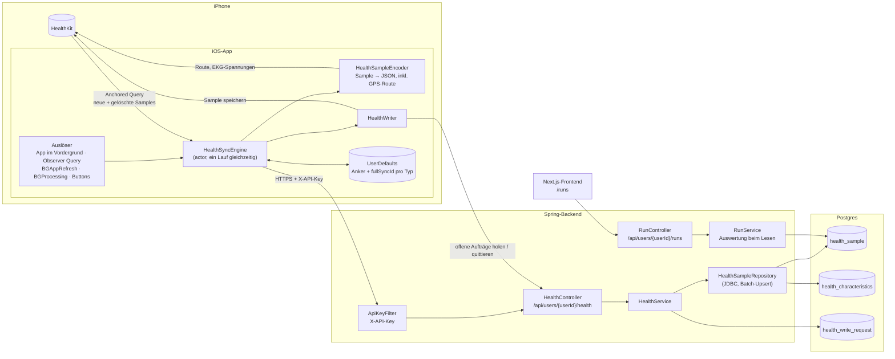
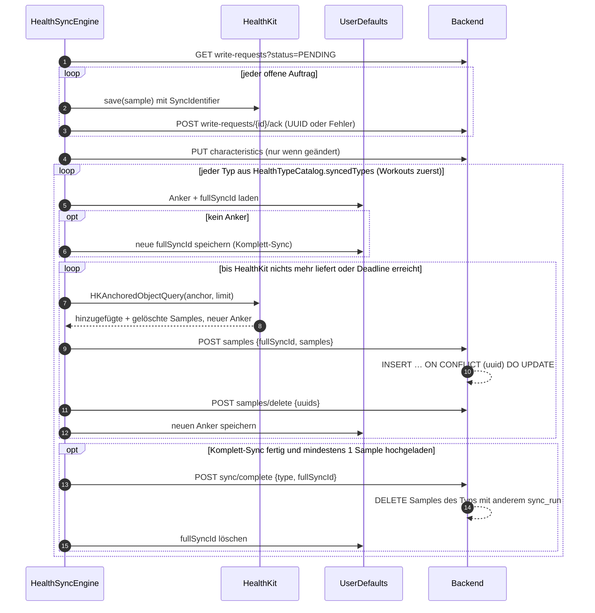
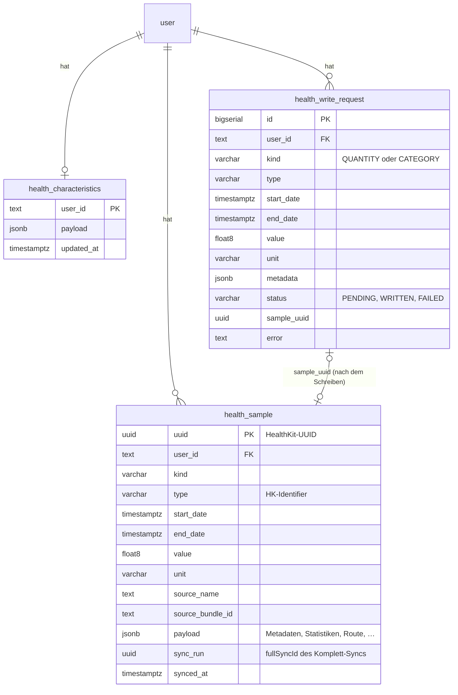

# Apple-Health-Sync

Die iOS-App spiegelt die Apple-Health-Daten des Nutzers in die Postgres-Datenbank des Backends. Der Sync läuft nur in eine Richtung (HealthKit → Backend), es gibt keinen Message Broker, nur HTTP. Zusätzlich kann das Backend Schreibaufträge hinterlegen, die die App beim nächsten Sync in HealthKit schreibt.

Die Daten werden roh gespeichert: eine Zeile pro HealthKit-Sample, alles ohne eigene Spalte landet als JSON im `payload`. Ausgewertet wird erst beim Lesen, z. B. die Läufe im `RunService`.

## Überblick

## Auslöser

Alle Wege rufen `HealthSyncEngine.shared.sync(deadline:)` auf. Läuft schon ein Sync, startet kein zweiter: Der laufende wird nur gebeten, danach noch einmal zu laufen.

| Auslöser | Wann | Zeitlimit |
| --- | --- | --- |
| App wird aktiv | `scenePhase == .active` | keins |
| `HKObserverQuery` + Background Delivery | HealthKit weckt die App bei neuen Samples (`frequency: .immediate`, Schritte u. Ä. drosselt HealthKit auf stündlich) | 20 s |
| `BGAppRefreshTask` | frühestens 30 min nach dem Schließen, als Fallback für verpasste Weckrufe | 25 s |
| `BGProcessingTask` | frühestens nach 2 h, mit Netzwerk, für lange Komplett-Syncs | keins (bis iOS abbricht) |
| „Jetzt synchronisieren“ / Pull-to-Refresh | manuell in der Health-Ansicht | keins |
| „Alles neu synchronisieren“ | manuell, vergisst alle Anker (`resetAndSync`) | keins |

Das Zeitlimit wird nur zwischen zwei Batches geprüft. Ein abgebrochener Lauf setzt beim nächsten Mal genau dort fort, siehe unten.

> Hintergrund-Sync funktioniert nur, solange die App installiert und signiert ist, mit einem kostenlosen Entwickler-Account also 7 Tage nach dem letzten Build.

## Ablauf eines Sync-Laufs

### Warum das robust ist

- **Anker erst nach dem Upload speichern.** Stirbt die App mitten im Batch, lädt der nächste Lauf denselben Batch noch einmal hoch. Das ist harmlos, weil das Backend per HealthKit-UUID upsertet und damit keine Duplikate entstehen.
- **Kleine Batches.** 500 Samples bei Quantity-, Category- und Correlation-Typen, 1 bei Workouts und EKGs (mit GPS-Route bzw. Spannungswerten kann ein einzelnes Sample fast 1 MB groß sein, das Standard-Body-Limit von nginx), sonst 100.
- **Gesperrtes Gerät.** HealthKit-Daten sind verschlüsselt, solange das iPhone gesperrt ist. `errorDatabaseInaccessible` bricht den Lauf ab, andere HealthKit-Fehler überspringen nur den betroffenen Typ.

### Komplett-Sync und gelöschte Samples

Inkrementell meldet HealthKit gelöschte Samples selbst (`deletedObjects`). Ohne Anker, etwa nach einer Neuinstallation oder „Alles neu synchronisieren“, geht diese Information verloren. Deshalb läuft ein Komplett-Sync so ab:

1. Die App erzeugt pro Typ eine `fullSyncId` und schickt sie bei jedem Batch mit. Das Backend speichert sie in `health_sample.sync_run`.
2. Ist der Typ vollständig hochgeladen, ruft die App `sync/complete` auf. Das Backend löscht alle Samples des Typs, deren `sync_run` nicht dieser Id entspricht. Das sind genau die Samples, die es in HealthKit nicht mehr gibt.
3. Hat der Komplett-Sync **kein einziges** Sample geliefert, wird `sync/complete` übersprungen. HealthKit gibt für Typen ohne Leseberechtigung keinen Fehler zurück, sondern einfach nichts. Ohne diese Ausnahme würde ein entzogenes Recht alle Daten des Typs im Backend löschen.

Weil `fullSyncId` und Anker in den UserDefaults liegen, kann sich ein Komplett-Sync über mehrere Läufe erstrecken.

## Was hochgeladen wird

`HealthSampleEncoder` macht aus jedem `HKSample` ein `HealthSampleUpload`:

| Feld | Inhalt |
| --- | --- |
| `uuid` | HealthKit-UUID, Primärschlüssel im Backend |
| `kind` | `QUANTITY`, `CATEGORY`, `WORKOUT`, `CORRELATION`, `ECG`, `AUDIOGRAM`, `STATE_OF_MIND`, `SCORED_ASSESSMENT` |
| `type` | HealthKit-Identifier, z. B. `HKQuantityTypeIdentifierHeartRate` |
| `startDate`, `endDate` | Zeitraum des Samples |
| `value`, `unit` | Messwert in der festen Einheit des Typs (`HealthTypeCatalog.unit(for:)`), bei Workouts die Dauer in Sekunden |
| `sourceName`, `sourceBundleId` | z. B. „Apple Watch von Daniel“ |
| `payload` | alles andere als JSON, siehe unten |

Immer im `payload`: `metadata`, `source` (Version, Gerätetyp, OS) und `device`, falls vorhanden.

Bei **Workouts** zusätzlich:

- `activityType`: `HKWorkoutActivityType`, z. B. 37 = Laufen
- `statistics`: pro Quantity-Typ `sum` / `average` / `minimum` / `maximum` mit Einheit (Distanz, Herzfrequenz, Energie, Schritte, …)
- `events`: Pause/Fortsetzen, Runden, Segmente
- `activities`: bei Multisport-Workouts
- `routes`: GPS-Track als kompakte Arrays `[Sekunden seit Start, Breite, Länge, Höhe, Geschwindigkeit, Kurs, horizontale Genauigkeit, vertikale Genauigkeit]`

Bei **EKGs** die Spannungswerte in µV, bei **Audiogrammen** die Messpunkte. Charakteristika wie Geburtsdatum oder Blutgruppe haben keine Samples und gehen per `PUT characteristics` in eine eigene Tabelle.

## Backend

Alle Endpunkte liegen unter `/api/users/{userId}/health` und verlangen den Header `X-API-Key` (`ApiKeyFilter`). App-Seite: `HealthSyncService`, Backend-Seite: `HealthController`.

| Methode | Pfad | Zweck |
| --- | --- | --- |
| `POST` | `/samples` | Batch hochladen (Upsert), optional mit `fullSyncId` |
| `POST` | `/samples/delete` | in HealthKit gelöschte UUIDs löschen |
| `POST` | `/sync/complete` | Komplett-Sync eines Typs abschließen |
| `PUT` / `GET` | `/characteristics` | Charakteristika speichern / lesen |
| `GET` | `/types` | Anzahl, erstes/letztes Datum und letzter Sync pro Typ (Anzeige in der App) |
| `GET` | `/samples?type=&from=&to=&page=&size=` | Rohdaten lesen, neueste zuerst |
| `POST` / `GET` | `/write-requests` | Schreibauftrag anlegen / offene Aufträge holen |
| `POST` | `/write-requests/{id}/ack` | Auftrag als geschrieben oder fehlgeschlagen quittieren |

`HealthSampleRepository` nutzt bewusst JDBC statt JPA: Pro Request kommen tausende Samples, und jedes ist ein `INSERT … ON CONFLICT (uuid) DO UPDATE`, was JPA nicht als Batch kann.

### Tabellen (`V3__create_health_tables.sql`)

Indizes: `(user_id, type, start_date)` für Abfragen eines Typs im Zeitraum (z. B. Herzfrequenz während eines Laufs) und `(user_id, start_date)`.

## Rückweg: Schreiben in HealthKit

Das Backend kann HealthKit nicht direkt erreichen. Deshalb legt es einen `health_write_request` an, den die App beim nächsten Sync abarbeitet, und zwar **vor** dem Upload, damit das neue Sample im selben Lauf zurückkommt.

1. `POST /write-requests` legt den Auftrag an (nur `QUANTITY` und `CATEGORY`, Status `PENDING`).
2. `HealthWriter` holt alle offenen Aufträge, prüft Typ, Einheit und Wert vorab (ungültige Werte würden HealthKit mit einer Objective-C-Exception abstürzen lassen) und speichert das Sample.
3. Das Sample bekommt `HKMetadataKeySyncIdentifier = labs-101.write-request.{id}`. Wird die App vor dem Quittieren beendet und der Auftrag erneut geschrieben, ersetzt HealthKit das Sample statt ein Duplikat anzulegen.
4. `POST /write-requests/{id}/ack` setzt den Status auf `WRITTEN` mit der neuen UUID, oder auf `FAILED` mit Fehlertext.
5. Über den normalen Sync landet das Sample in `health_sample`.

## Wo die Daten genutzt werden

Der Sync speichert nur Rohdaten. Fachliche Auswertungen lesen `health_sample` direkt:

- **Läufe:** `RunRepository` / `RunService` → `GET /api/users/{userId}/runs` → `/runs` im Frontend. Workouts mit `activityType = 37` plus die Herzfrequenz-Samples im Zeitraum des Laufs, ausgewertet bei jeder Anfrage (Distanz, Moving Time, Pace, Splits, Zonen, Bestleistungen). Tests: `RunTest`.
- **Sync-Status in der App:** `GET /types`.

Tests für den Sync selbst: `HealthSyncTest`.
